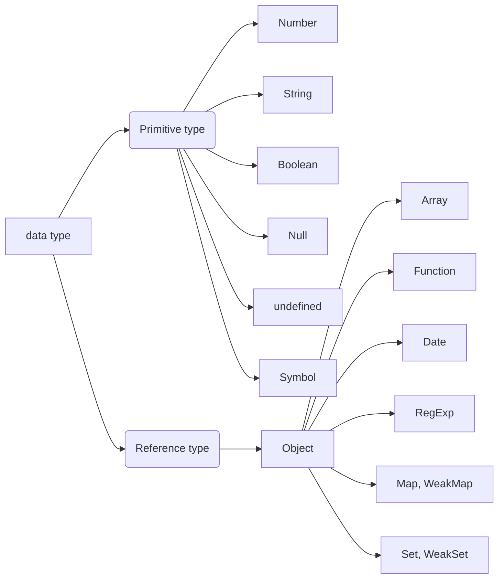

# CH1 데이터타입
## 01 데이터 타입의 종류
데이터 타입은 크게 2가지 종류가 있다.

- 기본형(primitive type)
	- number, string, boolean, null, undefined, Symbol(ES6)
- 참조형(reference type)
	- object, array, funciton, date, regexp, map(ES6), weakMap(ES6), set(ES6), weakSet(ES6)
## 02 데이터 타입에 관한 배경지식
### 1-2-1 메모리와 데이터
각 비트는 고유한 식별자(unique identifier)을 통해서 위치를 확인할 수 있다.
c/c++와는 달리 비교적 메모리에 자유로워지는 시기에 탄생했기 때문에, 상대적으로 메모리 관리에 대한 압박에 자유로워졌다. 그래서 메모리를 할당할 때 넉넉하게 할당하는 편이다. 이로 인해 개발자는 형변환 같은 걱정에 벗어나 코딩할 수 있게 되었다.
자바스크립트는 바이트단위의 식별자(메모리 주소값: memory address)를 통해 서로 구분하고 연결할 수 있게 되었다.
### 1-2-2 식별자와 변수
변수(variable)와 식별자(Identifier)은 서로 혼용하여 쓴다.
면밀히 나누자면, 변수는 "변할 수 있는 무언가"인 것이고, 식별자는 "어떤 데이터를 식별하는데 사용하는 이름"으로 나눌 수 있다.

## 03 변수 선언과 데이터 할당
### 1-3-1변수 선언
변수를 선언할 때, 이름과 저장할 데이터의 주소를 할당한다. 즉 `var a`를 선언할 때 메모리 중 어떤 위치에 a라는 이름과 빈 공간의 데이터 주소를 할당한다. 우리가 a에 대해서 접근 하고자 할 때, 선언되어 있는 a를 찾고, 그 안에 있는 데이터 주소를 찾을 것이다.
### 1-3-2데이터 할당
```js
var a;
a = 'abc';
// 좀 더 짧게
var a = 'abc';
```
위와 같이 작성 할 때, a에 직접 'abc'를 저장하지 않는다. a를 변수영역에 저장하고, 'abc'를 데이터 영역에 저장한 뒤, 'abc'의 주소 값을 변수영역에 있는 a에 저장한다. 
처음 보면 데이터를 효율적으로 저장하지 않는 것처럼 보인다. 하지만 좀 더 자세하게 보면 효율적으로 저장하는 것을 알 수 있다.
앞서 말했다싶이 자바스크립트는 메모리에 자유로운 장점이 있다. 이를 최대한 살리기 위해서는 string같은 정해져있지 않는 길이를 자유롭게 저장해야 한다. 익숙한 모델은 c/c++의 내용 중, 포인터를 이용하여 heap에 배열을 자유롭게 만드는 기법을 차용하여 만들 수 있다. 자바스크립트도 이런 기법을 차용하여 만든 것 같다.(추측)
또한 자바스크립트의 가장 큰 장점이 prototype을 저장하는데 효율적이다. 이는 추후 설명된다.
추가적으로 데이터를 새롭게 바꿀 때 기존에 있던 데이터영역의 위치를 바꾸는 것이 아닌, 새로운 데이터 영역을 할당 받은 후 변수영역에 있던 주소값을 변경하는 식으로 데이터를 바꾼다.
## 04 기본형 데이터와 참조형 데이터
### 1-4-1 불변값
변수(variable)와 상수(constant)를 구분하는 성질은 '변경 가능성'이다. 바꿀 수 있으면 변수, 바꿀 수 없으면 상수이다. 
조심해야 할 것이 상수와 불변성은 다른 것이다. 불변성은 데이터의 값이 변경이 안된다는 것이고, 상수는 변수영역에 있는 주소값이 변경 안된다는 것이다.
### 1-4-2 가변값
좀 더 풀자면 불변성에서 데이터를 바꿀때 다른 데이터영역에 새로운 데이터를 생성하고 옮기는 것일 뿐, 기존에 있는 데이터는 바뀌지 않는 다는 점이다.
이렇게 데이터를 바꾼다. 다시 보면 ssd의 동작방식과 스마트 포인터와 매우 비슷한 형식인것 같다.
### 1-4-3 변수 복사 비교
자바스크립트는 저장된 곳의 주소를 복사한다. 즉 주소의 주소를 복사한다고 할 수 있다. 그래서 `===`연산자도 쓸 수 있다.
## 05 불변 객체
### 1-5-1불변 객체를 만드는 간단한 방법
기본적으로 데이터를 바꾸려고 하면 기존 데이터는 변하지 않고, 새롭게 할당하여 변경된 것 처럼 보이게 한다. 그러더라도 불변객체가 필요할 때가 있다. 전달받은 객체가 변경이 되더라도, 기존의 객체는 변경이 안되고 싶을때이다.
```js
var user = {
	name: 'loopy',
	gender: 'male'
};

function changeName(user, newName) {
	var newUser = user;
	newUser.name = newName;
	return newName;
}

var user2 = changeName(user, '채승');
```
다음과 같은 경우 `user`와 `user1`은 같은 객체를 가리킨다. 이를 위해서는 다음과 같이 `changeName`을 수정해야 한다.
```js
function changeName(user, newName) {
	return {
		name: newName,
		gender: user.gener
	};
}
```
하지만 이 문제는 property가 많아질때 복잡해진다는 단점이 생기는데, 이를 단편적으로만 고쳐보자.
```js
// 얕은복사
function copyObject (target) {
	var result = {};
	for(let prop in target) {
		result[prop] = target[prop];
	}
	return result;
}
```
위와 같이 얕은 복사더라도 depth가 깊어진다면, 문제가 생기게 된다. 이를 해결하기 위해서 깊은 복사를 만들어야 한다.
### 1-5-2 얕은 복사와 깊은 복사
객체의 프로퍼티 중에서 기본형 데이터는 그대로 복사되지만 참조형 데이터는 그 내부의 프로퍼티를 복사해야 한다. 이런 점으로 깊은 복사를 하는 코드를 만들면
```js
function copyObjectDeep (target) {
	var result = {};
	if(typeof target === 'object' && target !== null) {
		for (var prop in target) {
			result[prop] = copyObjectDeep(target[prop]);
		}
	} else {
		result = target;
	}
	return result;
}
```
여기서 복사를 허용하지 않게 hasOwnProperty메소드를 활용할 수 있다. ES5의 getter/setter를 복사하는 방법은 ES6의 Object.OwnPropertyDescriptor또는 ES2017의 object.getOwnPertyDescriptions외에는 없다.
재미있는 점은 여기서 JSON객체를 활용하여 데이터를 복사하는 방법이다. 순수하게 데이터를 다룰 때 좋다고 한다.
## 06 undefined와 null
자바스크립트에서는 없음을 나타내는 것은 `undefined`와 `null`이 있다.
자바스크립트 엔진이 `undefined`를 부여하는 3가지 경우가 있다.
- 값을 대입하지 않는 변수, 즉 데이터 영역의 메모리 주소를 지정하지 않은 식별자에 접근할 때
- 객체 내부의 존재하지 않는 프로퍼티에 접근하려고 할 때
- return 문이 없거나 호출되지 않는 함수의 실행 결과
1번의 결과는 생성은 되었으나, 데이터가 없는 경우로 해석하면 된다.

재미있는 점은 배열로 순회할 때 undefined는 배열에 들어간다는 점이다.

또한 조심해야 하는 부분이 있는데 `null`은 `object`이다.(무슨 말이 되는 소리야...) 그래서 `null == undefined`는 `true`가 나오고, 명확히 하기 위해서는 `null === undfined`를 해야한다.

