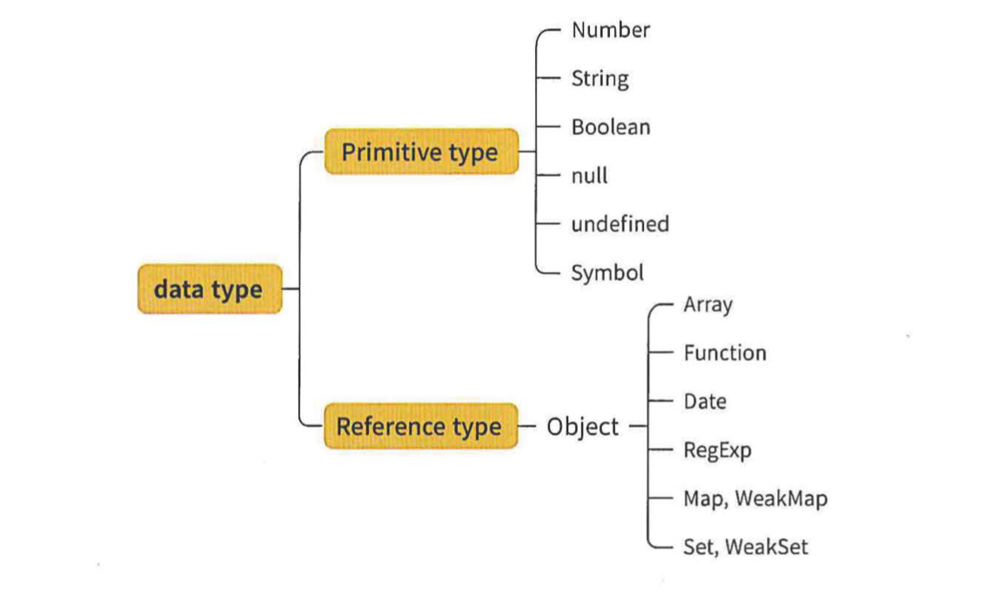
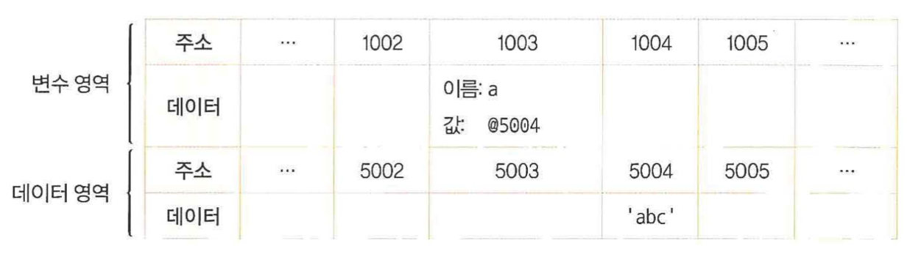
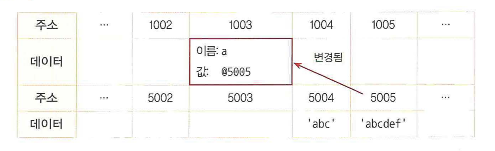
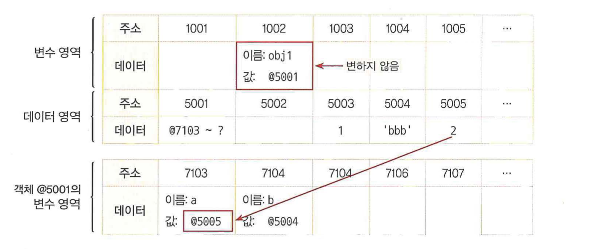
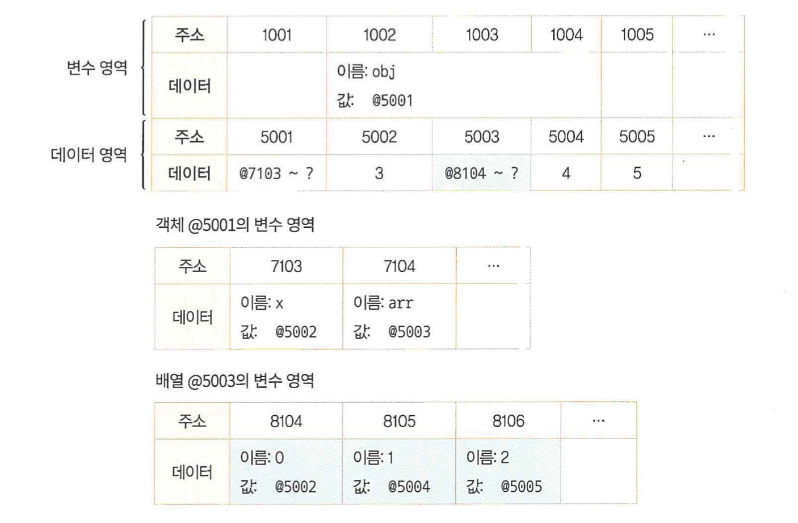
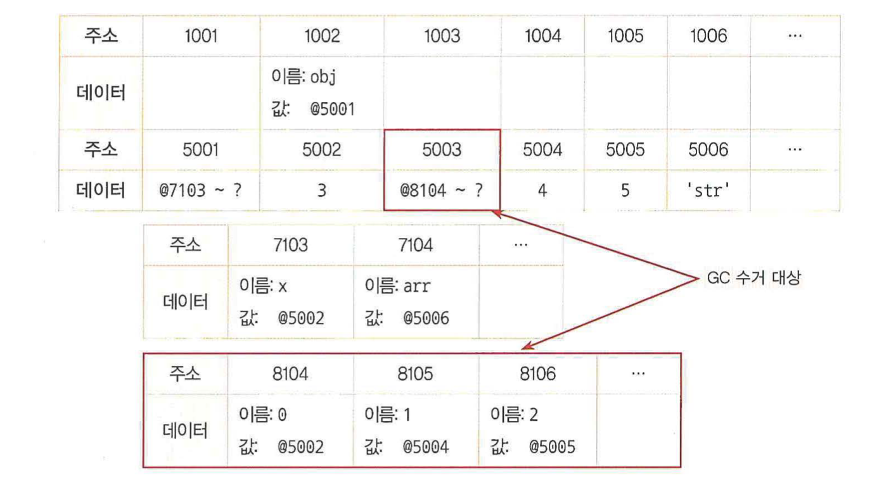
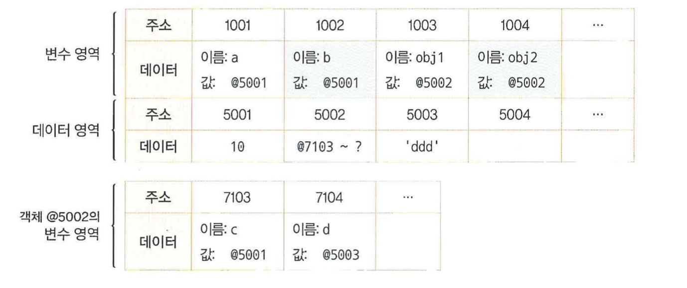

# 1-1. 데이터 타입의 종류

- 자바스크립트의 데이터 타입은 **기본형**과 **참조형**으로 분류된다
  

1. **기본형**
   - 숫자, 문자열, 불리언, null, undefined, 심볼
   - 복제할 시, 값이 담긴 주소값을 바로 복제
   - **불변성**
2. **참조형**
   - 객체, 배열, 함수, 날짜, 정규표현식, Map, WeakMap, Set, WeakSet
   - 복제할 시, 값이 담긴 주소값들로 이루어진 묶음을 가리키는 주소값을 복제

# 1-2. 데이터 타입에 관한 배경지식

## 1-2-1. 메모리와 데이터

- 컴퓨터는 모든 데이터를 0 또는 1로 바꿔 기억한다
  - **비트** : 0 또는 1만 표현할 수 있는 하나의 메모리 조각
  - 각 비트는 고유한 **식별자**를 통해 위치 확인
- 0 혹은 1만 표현할 수 있는 비트 단위로 위치를 확인하는 것은 비효율적
  - 비트를 한 단위로 묶으면 검색 시간은 줄이고 표현할 수 있는 데이터의 개수도 늘어나지만, 동시에 낭비되는 비트가 생긴다 → 표현 가능한 개수에 제약이 따르더라도 적정한 공간을 묶자
  - **바이트**: **8개의 비트**로 구성되어 총 256개의 값 표현 가능
  - 비트의 고유한 식별자와 같이, 바이트는 **메모리 주솟값**을 통해 서로 구분하고 연결한다
- 메모리 용량 제한에서 과거보다 자유로운 상황에서 등장한 자바스크립트
  - 숫자의 경우 정수형과 부동소수형을 구분하지 않고 넉넉히 **8바이트(=64비트)** 확보

## 1-2-2. 식별자와 변수

1. **변수**
   - 변할 수 있는 **데이터**
2. **식별자**
   - 데이터를 식별하는 데 사용하는 이름
   - **변수명**

# 1-3 변수 선언과 데이터 할당

## 1-3-1. 변수 선언

```jsx
var a;
```

- **변수**는 결국 **변경 가능한 데이터가 담길 수 있는 공간 또는 그릇**

## 1-3-2. 데이터 할당

- 데이터 할당에 대한 메모리 영역의 변화

  ```jsx
  var a; // 변수 a 선언
  a = "abc"; // 변수 a에 데이터 할당

  var a = "abc"; // 변수 선언과 할당을 한 문장으로 표현
  ```

  

  1. 변수 영역에 빈 공간(@1003) 확보
  2. 확보한 공간의 식별자를 a로 지정
  3. 데이터 영역의 빈 공간(@5004)에 문자열 ‘abc’ 저장
  4. 변수 영역에서 a라는 식별자를 검색(@1003)
  5. 앞서 저장한 문자열의 주소(@5004)를 @1003의 공간에 대입

### **왜 변수 영역에 값을 직접 대입하지 않고 한 단계를 더 거칠까?**

- **자유로운 데이터 변환**과 **효율적인 메모리 관리**
- 자바스크립트는 숫자형 데이터에 대해 8바이트의 공간을 확보하지만 문자열은 특별히 정해진 규격이 없다
- 미리 확보된 공간 내에서 데이터 변환을 할 수 있다면 변환한 데이터를 다시 저장하기 위해 ‘확보된 공간을 변환된 데이터 크기에 맞게 늘리는 작업'이 선행되어야 함 → 컴퓨터가 처리할 연산이 많아진다

- 문자열 ‘abc’의 마지막에 ‘def’를 추가하라고 한다면…

  

  - 컴퓨터는 앞서 ‘abc’가 저장된 공간에 ‘abcdef’를 할당하는 대신, ‘abcdef’라는 문자열을 **새로** 만들어 별도의 공간에 저장
  - 그 주소를 변수 공간에 연결

- 500개의 변수를 생성해 모든 변수에 숫자 5를 할당한다면…
  - 각 변수를 별개로 인식하려면 500개의 변수 공간을 확보하는 것은 불가피하다
  - 각 변수 공간마다 매번 숫자 5를 할당할 때: 숫자형은 8바이트가 필요함으로 총 4000(500 \* 8)바이트 필요
  - 5를 별도의 공간에 한 번만 저장하고 해당 주소만 입력할 때: 주소 공간의 크기가 2바이트라고 한다면 1008(500 \* 2 + 8)바이트 필요

# 1-4. 기본형 데이터와 참조형 데이터

## 1-4-1. 불변값

- 변수와 상수를 구분하는 성질은 **변경 가능성**이다
  - 바꿀 수 있으면 변수, 바꿀 수 없으면 상수
- 변수와 상수를 구분짓는 변경 가능성의 대상은 **변수 영역 메모리**
  - 한 번 데이터 할당이 이뤄진 변수 공간에 다른 데이터를 재할당할 수 있는지 여부
- 불변성 여부를 구분할 때의 변경 가능성의 대상은 **데이터 영역 메모리**
- 기본형 데이터(숫자, 문자열, boolean, null, undefined, Symbol)은 모두 불변값

- 불변성

  ```jsx
  var a = "abc";
  a = a + "def";

  var b = 5;
  var c = 5;
  b = 7;
  ```

  - a가 문자열 ‘abc’ 할당 후 뒤에 ‘def’를 추가하면 기존의 ‘abc’가 ‘abcdef’로 바뀌는 것이 아니라 새로운 문자열 ‘abcdef’를 만들어 그 주소를 변수 a에 저장
    - ‘abc’와 ‘abcdef’는 완전히 별개의 데이터
  - 변수 b에 숫자 5를 할당할 때, 일단 데이터 영역에서 5를 찾고 없으면 데이터 공간을 하나 만들어서 저장
  - 변수 c에 같은 수인 5를 할당할 때, 데이터 영역에서 5를 찾고 그 주소를 재활용
  - 변수 b의 값을 7로 바꾸자고 할 때, 기존에 저장된 5 자체를 7로 바꾸는 것이 아님
    - 기존에 저장했던 7을 찾아서 있으면 재활용, 없으면 새로 만들어서 주소를 b에 저장
    - 결국 5와 7 모두 다른 값으로 변경 불가

- 문자열과 숫자 값을 한 번 만든 값을 바꿀 수 없다
- 변경은 새로 만드는 동작을 통해서만 이루어진다 = **불변값의 성질**
- 한 번 만들어진 값은 가비지 컬렉팅을 당하지 않는 한 영원히 변하지 않는다

## 1-4-2. 가변값

- 참조형 데이터의 할당

  ```jsx
  var obj1 = {
    a: 1,
    b: "bbb",
  };
  ```

  

  - 변수 영역의 빈 공간(@1002) 확보하고, 그 주소의 이름을 obj1로 지정
  - 임의의 데이터 저장 공간(@5001)에 데이터를 저장하려고 보니 여러 개의 프로퍼티로 이뤄진 데이터 그룹 → 그룹 내부의 프로퍼티를 저장하기 위해 별도의 변수 영역 마련한 후, 그 영역의 주소(@7103~?)를 @5001에 저장
  - @7103 및 @7104에 각각 a와 b라는 프로퍼티 이름 지정
  - 데이터 영역에서 숫자 1을 검색했는데 검색 결과가 없음 → 임의로 @5003에 저장한 후, 이 주소를 @7103에 저장
  - 문자열 ‘bbb’ 역시 검색 결과가 없으므로 임의로 @5004에 저장한 후, 이 주소를 @7104에 저장

- 기본형 데이터와의 차이는 **‘객체의 변수(프로퍼티) 영역'이 별도로 존재**하다는 것
  - 객체가 별도로 할애한 영역은 변수 영역일 뿐, 데이터 영역은 기존의 메모리 공간을 활용
- 데이터 영역에 저장된 값은 모두 불변값이지만 변수에는 다른 값을 얼마든지 대입 가능 → 참조형 데이터는 불변하지 않다(**가변값**이다)

- 참조형 데이터의 프로퍼티 재할당

  ```jsx
  var obj1 = {
    a: 1,
    b: "bbb",
  };
  obj1.a = 2;
  ```

  

  - obj1의 a 프로퍼티에 숫자 2를 할당하려고 한다
  - 데이터 영역에서 숫자 2를 검색한 후, 검색 결과가 없으니 빈 공간인 @5005에 저장한 후 이 주소를 @7103에 저장
  - 변수 obj1이 바라보고 있는 주소는 @5001로 변하지 않음
  - 새로운 객체가 만들어진 것이 아니라 기존의 객체 내부의 값만 바뀐 것

- 중첩된 참조형 데이터(객체)의 프로퍼티 할당

  ```jsx
  var obj = {
    x: 3,
    arr: [3, 4, 5],
  };
  ```

  

  - 변수 영역의 빈 공간(@1002) 확보 후 주소 이름 obj로 지정
  - 데이터가 객체이므로 각 변수를 저장할 별도의 변수 영역(@7103~?) 마련한 후, 그 영역의 주소를 @5001에 저장
  - @7103에 이름 x를, @7104에 이름 arr 지정
  - 숫자 3을 임의로 @5002에 저장한 후, 주소를 @7103에 저장
  - @7104에 저장할 값은 배열로 데이터의 그룹 → 별도의 변수 영역(@8104~?) 마련한 후, 그 영역의 주소를 @5003에 저장한 다음, @5003을 @7104에 저장
  - 배열의 요소들 할당

- obj.arr[1]의 검색 과정

  - obj 검색: @1002 → @5001 → @7103~?
  - obj.arr 검색: @7104 → @5003 → @8104~?
  - obj.arr[1] 검색: @8105 → @5004 → 4 반환

- 중첩된 참조형 데이터의 프로퍼티 재할당
  ```jsx
  obj.arr = "str";
  ```
  
  - @5006에 문자열 ‘str’ 저장한 후, 그 주소를 @7104에 저장
  - @5003은 자신의 주소를 참조하는 변수가 하나도 없게 됨
  - **참조 카운트**: 어떤 데이터에 대해 자신의 주소를 참조하는 변수의 개수
    - @5003의 참조 카운트는 @7104에 저장돼 있던 시점까지 1이었다가, @7014에 @5006이 저장된 순간 0이 됨
  - 참조 카운트가 0인 메모리 주소는 **가비지 컬렉터**의 수거 대상이 된다
    - 가비지 컬렉터는 런타임 환경에 따라 특정 시점이나 메모리 사용량이 포화 상태에 임박할 때마다 자동으로 수거 대상들을 수거 → 수거된 메모리는 다시 새로운 값을 할당할 수 있는 빈 공간이 됨
  - @5003은 참조 카운트가 0이 됨에 따라 GC 대상 → 담겨 있던 데이터인 @8104~? 값이 사라짐
    - @8104~?의 각 데이터의 참조 카운트도 0이 됨에 따라 GC 대상이 되어 사라짐

## 1-4-3. 변수 복사 비교

- 변수 복사

  ```jsx
  var a = 10;
  var b = a;

  var obj1 = { c: 10, d: "ddd" };
  var obj2 = obj1;
  ```

  

  1. 기본형 데이터의 변수 복사
     - 변수 영역의 빈 공간 @1001 확보 후 식별자를 a로 지정
     - 숫자 10을 데이터 영역에서 검색한 후, 검색 결과가 없으므로 빈 공간 @5001에 저장하고 이 주소를 @1001에 넣음
     - 변수 영역의 빈 공간 @1002 확보 후 식별자를 b로 지정
     - 식별자 a를 검색해 @1001에 저장된 값인 @5001을 @1002에 값으로 대입
  2. 참조형 데이터
     - 변수 영역의 빈 공간 @1003 확보 후 식별자를 obj1로 지정
     - 데이터 영역의 빈 공간 @5002를 확보하고, 데이터 그룹을 담기 위해 별도의 변수 영역 @7103~?을 확보해 그 주소를 저장
     - @7103에서는 식별자 c를, @7104에서는 식별자 d를 입력
     - c에 대입할 값 10을 검색한 후, 10이 @5001에 이미 저장되어 있으므로 이 주소를 @7103에 연결
     - 문자열 ‘ddd’는 빈 공간에 새로 만들어 @7104에 연결

# 1-5. 불변 객체

## 1-5-1. 불변 객체를 만드는 간단한 방법

- 참조형 데이터의 가변은 데이터 자체가 아닌 내부 프로퍼티를 변경할 떄만 성립
- 데이터 자체를 변경하고자 하면(새로운 데이터를 할당하고자 하면) 기본형 데이터와 마찬가지로 기존 데이터는 변하지 않는다

  - 불변성을 확보하는 방법
    - 내부 프로퍼티를 변경할 필요가 있을 때마다 **매번 새로운 객체를 만들어 재할당**하기
    - **자동으로 새로운 객체를 만드는 도구를 활용**하기

- 객체의 가변성에 따른 문제점 해결 방법

  ```jsx
  var user = {
    name: "Jaenam",
    gender: "male",
  };

  var changeName = function (user, newname) {
    return {
      name: newName,
      gender: user.gender,
    };
  };

  var user2 = changeName(user, "Jung");

  if (user !== user2) {
    console.log("유저 정보 변경됨"); // 유저 정보 변경됨
  }

  console.log(user.name, user2.name); // Jaenam Jung
  console.log(user === user2); // false
  ```

  - `changeName` 함수가 새로운 객체 반환
  - 변경할 필요가 없는 기존 객체의 프로퍼티를 하드코딩으로 입력함 → 대상 객체에 정보가 많을수록 사용자가 입력하는 수고 늘어남
    - 대상 객체의 프로퍼티 개수에 상관없이 모든 프로퍼티를 복사하자

- 기존 정보를 복사해서 새로운 객체를 반환하는 함수(얕은 복사)
  ```jsx
  var copyObject = function (target) {
    var result = {};
    for (var prop in target) {
      result[prop] = target[prop];
    }
    return result;
  };
  ```
  - 모든 개발자들이 user 객체 내부의 변경이 필요할 때 무조건 `copyObject` 함수를 사용하기로 합의하고 그 규칙을 지킨다면 user 객체는 곧 불변 개개체
  - 하지만 이보다 규칙을 따르지 않으면 프로퍼티 변경을 할 수 없게 **시스템적으로 제약을 거는 것이 안전** (ex. immutable.js, baobab.js)

## 1-5-2. 얕은 복사와 깊은 복사

- **얕은 복사**: 바로 아래 단계의 값만 복사
  - 중첩된 객체에서 참조형 데이터가 저장된 프로퍼티를 복사할 때 그 주소값만 복사함 → 해당 프로퍼티에 대해 원본과 사본이 모두 동일한 참조형 데이터의 주소를 가리킨다
- **깊은 복사**: 내부의 모든 값들을 하나하나 찾아서 전부 복사하는 방법

- 어떤 객체를 복사할 때 객체 내부의 모든 값을 복사해 완전히 새로운 데이터로 만들고자 할 때

  - 객체의 프로퍼티 중에서 그 값이 **기본형** 데이터일 경우: **그대로 복사**
  - 객체의 프로퍼티 중에서 그 값이 **참조형** 데이터일 경우: 다시 그 **내부의 프로퍼티들을 복사**해야 함
  - 이 과정을 참조형 데이터가 있을 때마다 **재귀적으로 수행**해야만 비로소 **깊은 복사**

- 객체의 깊은 복사를 수행하는 범용 함수

  ```jsx
  var copyObjectDeep = function (target) {
    var result = {};
    if (typeof target === "object" && target !== null) {
      for (var prop in target) {
        result[prop] = copyObjectDeep(target[prop]);
      }
    } else {
      result = target;
    }
    return result;
  };
  ```

  - `target`이 객체인 경우 내부 프로퍼티들을 순회하며 `copyObjectDeep` 함수를 재귀적으로 호출
  - 객체가 아닌 경우 `target` 그대로 지정
  - 객체를 깊은 복사한 다음에는 원본과 사본이 서로 완전히 다른 객체를 참조하게 되어 어느 쪽의 프로퍼티를 변경하더라도 다른 쪽에 영향을 주지 않음

- JSON을 활용한 간단한 깊은 복사
  ```jsx
  var copyObjectViaJSON = function (target) {
    return JSON.parse(JSON.strignify(target));
  };
  ```
  - 객체를 JSON 문법으로 표현된 문자열로 전환했다가 다시 JSON 객체로 바꾸기
  - 매서드(함수)나 숨겨진 프로퍼티와 같이 JSON으로 변경할 수 없는 프로퍼티들은 모두 무시
  - httpRequest로 받은 데이터를 저장한 객체를 복사할 때 등 순수한 정보만 다룰 때 활용하기 좋은 방법

# 1-6. undefined와 null

- **undefined**

  - 사용자가 명시로 지정 가능
  - 값이 존재하지 않을 때 자바스크립트 엔진이 자동으로 부여
  - 자바스크립트 엔진은 사용자가 어떤 값을 지정할 것이라고 예상되는 상황임에도 실제로 그렇게 하지 않을 때 undefined를 반환
    - **값을 대입하지 않은 변수**, 즉 데이터 영역의 메모리 주소를 지정하지 않은 식별자에 접근할 때
    - 객체 내부의 **존재하지 않는 프로퍼티**에 접근하려고 할 때
    - return문이 없거나 호출되지 않는 함수의 실행 결과

- undefined와 배열

  ```jsx
  var arr1 = [];
  arr1.length = 3;
  console.log(arr1); // [empty x 3]

  var arr2 = new Array(3);
  console.log(arr2); // [empty x 3]

  var arr3 = [undefined, undefined, undefined];
  console.log(arr3); // [undefined, undefined, undefined]
  ```

  - `[empty x 3]`: 배열에 3개의 빈 요소를 확보했지만 확보된 각 요소에는 어떤 값도 `undefined`조차도 할당돼 있지 않음
  - 비어있는 요소와 `undefined`를 할당한 요소는 출력 결과부터 다름
  - 비어있는 요소는 순회와 관련된 많은 배열 메서드들의 순회 대상에서 제외

- 비어있는 요소와 배열의 순회

  ```jsx
  var arr1 = [undefined, 1);
  var arr2 =[];
  arr2[1]=1;

  arr1 .forEach(function (v, i) { console.log(v, i); }); // undefined 0 / 1 1
  arr2.forEach(function (v, i) { console.log(v, i); }); // 1 1

  arr1.map(function(v, i){return v + i; }); // {NaN, 2}
  arr2.map(function (v, i) { return v + i; }); // {empty, 2}

  arr1.filter(function (v) { return !v; }); // {undefined}
  arr2.filter(function (v) { return !v; }); // []

  arr1.reduce(function(p,c,i){returnp+C+i;},’'); // undefined011
  arr2.reduce(function (p, c, i) { return p + C + i; }, ’'); // 1 1
  ```

  - **사용자가 직접 undefined를 할당**한 arr1에 대해 일반적으로 알고 있는 대로 **배열의 모든 요소를 순회**해서 결과 출력
  - arr2에 대해 각 메서드들이 **비어 있는 요소**에 대해서는 **어떠한 처리도 하지 않고 건너뛰었음**
  - 배열도 객체 → **존재하지 않는 프로퍼티에 대해 순회할 수 없음**
    - length 프로퍼티의 개수만큼 빈 공간을 확보한 후 각 공간에 인덱스를 이름으로 지정하는 것 X
    - **특정 인덱스에 값을 지정할 때 비로소 빈 공간을 확보**하고 인덱스를 이름으로 지정하고 데이터의 주소값 저장
    - 값이 지정되지 않은 인덱스는 아직 **존재하지 않는 프로퍼티**

- **사용자가 명시적으로 부여**한 `undefined`: 그 자체로 **값**이며 하나의 값으로 동작
  - 프로퍼티나 배열의 요소는 고유의 키값(프로퍼티 이름)이 **실존**하며 **순회의 대상**이 된다
  - 실존하는 데이터
- 사용자가 **명시하지 않아 자바스크립트 엔진이 반환한** `undefined`: 해당 프로퍼티 내지 배열의 키값(인덱스) 자체가 존재하지 않음
  - **문자 그대로 값이 없음**을 나타낸다
- 혼란을 피하기 위해 둘 중 하나를 사용하지 말자

  - `undefined` 대신 같은 ‘비어있음'의 의미인 **null을 사용하자**

- `typeof null`은 `object`: 자바스크립트 자체 버그

  ```jsx
  var n = null;
  console.log(typeof n); // object

  console.log(n == undefined); // true
  console.log(n == null); // true

  console.log(n === undefined); // false
  console.log(n === null); // true
  ```

  - 동등 연산자(`==`)로 비교할 경우 `null`과 `undefined`가 **서로 같다고 판단**
  - 일치 연산자(`===`)를 써야만 **정확히 판별** 가능

# 1-7. 정리

- 자바스크립트의 데이터 타입
  - **기본형**: **불변값**
  - **참조형**: **가변값**
- **변수**: 변경 가능한 데이터가 담길 수 있는 공간
- **식별자**: 변수의 이름
- 변수를 선언하면 컴퓨터는 **메모리의 빈 공간에 식별자 저장** → 그 공간에 자동으로 **undefined 할당**
- 변수에 **기본형** 데이터를 할당하려고 하면, **별도의 공간에 데이터 저장** → **그 공간의 주소를 변수의 값 영역에 할당**
- 변수에 **참조형** 데이터를 할당하고자 하는 경우, 컴퓨터는 참조형 데이터 **내부 프로퍼티들을 위한 변수 영역**을 별도로 확보 → 확보된 주소를 변수에 연결 → 확보한 변수 영역에 **각 프로퍼티의 식별자 저장** → 각 데이터를 별도의 공간에 저장한 후 그 주소를 식별자들과 매칭
- 할당 과정에서 기본형과 참조형의 차이가 생긴 이유: 참조형 데이터는 여러 개의 프로퍼티(변수)를 모은 그룹이기 때문 → 이 차이로 참조형 데이터를 가변값으로 여겨야 하는 상황 발생
- 참조형 데이터를 불변값으로 사용하는 방법
  - 내부 프로퍼티들을 일일이 복사(**깊은 복사**)
  - **라이브러리** 사용
- 없음
  - `undefined`: 어떤 변수에 값이 존재하지 않을 경우
  - `null`: 사용자가 명시적으로 없음을 표현하기 위해 대입한 값
  - **undefined를 대입하는 것을 지양하자**
