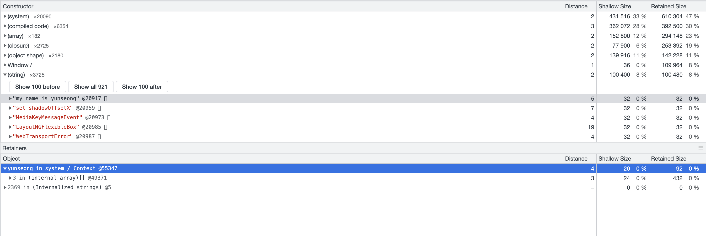

# 데이터 타입

## 데이터 타입의 종류
데이터 타입에는 크게 두가지 종류가 있다.

### 기본형(primitive type)
- 숫자(number)
- 문자열(string)
- 불리언(boolean)
- null
- undefined
- Symbol

### 참조형(reference type)
- 객체(object) : 사실 상 자바스크립트의 모든 게 객체이다.
  - 배열(Array)
  - 함수(Function) 등등..

## 데이터 타입에 관한 배경지식
컴퓨터는 모든 데이터를 0과 1로 바꿔 기억한다. 이는 너무나도 당연하고, 우리가 지금까지 배운 과목들에서 접할 수 있는 지식이다.

이러한 0과 1로 표현할 수 있는 하나의 메모리 조각을 **비트(bit)** 라고 한다.

우리가 컴퓨터를 처음 만든 사람의 입장에서 생각해보자.. 이렇게 0과 1로 표현하면 다음에는 어떤 문제가 따를까?

바로 저장한 값들을 **의미 있는 값** 으로 구분해야 된다는 것이다. 단순히 저장한다 하더라도, 우리는 이 저장한 값을 의미있는 정보로 사용하기 위해서는 의미 있는 값으로 구분해야 한다.

그래서 컴퓨터 설계자는 각 비트를 **고유한 식별자** 를 통해 데이터의 위치를 확인할 수 있게 설계했다.

그럼 어떻게 의미있는 정보를 식별해야 되는가? 매우 많은 비트를 묶으면 검색 시간도 줄일 수 있고 표현할 수 있는 데이터의 범위도 늘어나지만, 낭비되는 비트도 늘어난다.

그렇다고 매우 적은 비트를 식별하게 설계하면, 검색 시간이 늘어나거나 표현할 수 있는 데이터의 범위도 줄어들 것이다.

그런 고민의 결과들로, 표현 가능한 개수에 어느 정도 제약이 따르더라도 크게 문제가 되지 않을 적정한 공간을 묶었는데, 이가 바로 8비트를 하나로 묶은 1byte이다.

### 정적 타입 vs 동적 타입

프로그래밍 언어의 관점에서 살펴보자. (지금까지는 메모리의 관점에서 보았다.) 프로그래밍 언어에서는 사람이 편하게 사용할 수 있게 다양한 자료형을 비트로 표현한다.

예를 들어, 정수형은 십진수의 수를 이진수로 표현하는데, 음수를 표현하기 위해 2의 보수법으로 표현한다. 실수형은 대부분의 프로그래밍 언어가(사실 상 전부) [IEEE_754](https://ko.wikipedia.org/wiki/IEEE_754) 표준을 채택해 표현하고, 문자열은 아스키코드나 인코딩 방식에 의해 이진수로 표현한다.

이러한 표현 방식을 사용하고 메모리의 낭비를 최소화하기 위해 C, Java 등의 언어는 데이터 타입별로 할당한 메모리 영역을 2byte, 4byte 등으로 나누어 정해놓았다.

예를 들어, 2바이트 크기의 정수형을 표현하는 short 자료형은 0을 포함해 -32768 ~ +32767의 숫자만 허용한다. 이 숫자를 초과하는 데이터를 담으려 한다면, 숫자를 제대로 표현하지 못하는 Overflow가 발생하므로 프로그래머는 더 큰 숫자를 담을 수 있는 4byte int형을 사용해 데이터를 담아야 한다.

이렇게 컴파일 시 변수의 타입이 결정되는 언어를 **정적 타입 언어(static type language)** 라고 한다.

반면 Javascript, Python 같은 언어는 숫자를 예를 들면 정수형인지 부동소수형인지 구분하지 않고 일단 넉넉하게 비트를 할당받아 런타임에 타입을 결정한다. 이러한 언어를 **동적 타입 언어(dynamic type language)** 라고 한다. 

이러한 차이가 있는 경우는 각각 장단점이 있기 때문이다. 아래 표로 살펴보자.

|     |static type|dynamic type|
|---|---|---|
|**장점**|타입 안정성 높음|코드 유연성이 높음|
|   |실행속도가 빠름 |빠른 코드 작성이 가능|
|**단점**|번거로움|타입에러가 잦을 수 있음|

### 식별자와 변수
식별자와 변수는 얼핏보면 같은 말 같다.

변수란 엄밀히 따지면 변할 수 있는 수 이다. 컴퓨터 공학에서는 '수' 보다는 '값'에 가까운데, **변할 수 있는 무언가(data)** 라고 생각하면 좋을 것 같다.

식별자는 말 그대로 어떤 데이터를 식별하는 데 사용하는 이름, 즉 **변수명** 이다.

## 변수 선언과 데이터 할당
이제 자바스크립트가 어떻게 변수를 선언하고, 데이터를 할당하는 지 개발자 도구를 통해 살펴보자.
```html
<!DOCTYPE html>
<html>
<body>
</body>
<script>
    let yunseong = "my name is yunseong";
</script>
</html>
```
이처럼 코드를 짜고, 개발자 도구에서 Memory -> heap snapshot을 찍으면 다음과 같이 나온다.



보듯이 `yunseong`은 @55347 에 할당되고, `"my name is yunseong"`은 @20917에 할당되어 있음을 볼 수 있다.

이 결과로, **변수** 가 할당되는 주소와 **실제 값** 이 할당되는 위치가 다름을 추측할 수 있다.

정리하면, 변수는 **실제 값이 저장되어 있는 힙 영역을 참조한다.**

저장되는 순서는 다음과 같다.

1. 변수 영역에서 빈 공간을 찾아 확보한다. (선언 과정)
2. 확보한 공간을 식별자 `yunseong`으로 지정한다.
3. 데이터 영역의 빈 공간에 문자열 `"my name is yunseong"` 을 저장한다.
4. 변수 영역에서 `yunseong` 식별자를 검색한다.
5. 앞서 지정한 문자열의 주소를 @55347에 대입한다.

이후 설명에서는 책과 같이 메모리 구조를 추상화해 설명한다.

이렇게 번거롭게 선언, 할당하는 이유는 동적 타입 언어인 자바스크립트의 특징으로 데이터 변환을 자유롭게 할수 있게 함과 동시에 메모리를 더욱 효율적으로 관리하기 위해서 이다.

또한 변수 영역과 데이터 영역을 나눔으로써 데이터를 유연하게 할당할 수 있게 한다.

## 메모리에 저장되는 방식
데이터가 메모리에 저장되는 방식은 가변값과 불변값에 따라 달라진다. 

### 불변값
불변값은 자바스크립트의 숫자, 문자열, 불리언, 심볼 등의 값이다.

이 데이터들은 데이터 영역에 저장되어 값이 사용되지 않을 때 까지 사라지지 않는다.

사용되지 않는 것은 어떻게 판단할 수 있을까? 이는 자바스크립트의 가비지 컬렉터가 자동으로 메모리를 관리해준다.

다음 코드를 봐보자.
```js
let a = 1;
let b = 1;
```
a 변수에 1이 할당 될 때, 새로운 1이 데이터 영역에 할당된다.

그 이후 b 변수에 1을 할당할 때는 이미 있는 1의 값을 참조한다.

즉, a를 할당할 때 만들어 놓은 1을 재사용한다.

### 가변값(객체)
자바스크립트에서 가변값은 객체이다.

객체는 다른 기본형 데이터 값을 프로퍼티로서 참조한다. 즉, 객체란 여러 개의 프로퍼티로 이루어진 데이터 그룹이다.

코드의 예시로 가변값이 어떻게 객체를 저장하는지 살펴보자.
```js
var user {
  name: "yunseong",
  age: 24,
};
```
먼저 변수 영역에 user를 저장하기 위해 메모리를 확보한다.

메모리를 확보하고 나서는, 이제 객체의 프로퍼티를 저장할 차례이다. 그런데 객체는 원시값을 바로 저장하는 것이 아닌 프로퍼티로 저장한다.

그러기 때문에, 프로퍼티를 저장할 영역을 정한다. 따라서 user가 참조하는 주소의 메모리에 담기는 값은 프로퍼티를 저장할 영역의 주소값들이 담긴다.

그 이후 프로퍼티가 원시값이면 그 주소값에 원시값의 참조를 저장하고, 아니라면 재귀적으로 반복한다.

이 원리를 알고나면 중첩 객체가 어떤식으로 이루어져 있는지도 알 수 있고, 얕은 복사와 깊은 복사에 대해서도 쉽게 파악할 수 있다.

## 얕은 복사와 깊은 복사

얕은 복사는 참조하는 주소만 복사해가는 방식이다.

만약 책을 복사한다고 하면 책을 직접 복사해서 주는게 아닌 이름만 바꿔서 주는 것이다.

```js
const book = {
  name: "computer network",
  price: 10000,
  author: "unknown",
  content: "routing is.."
};

let yunseongBook = book;

yunseongBook.price = 5000;

console.log(book.price) // expect 10000, but print 5000
```
이처럼 문제가 발생하는 이유는 `book`과 `yunseongBook`이 같은 객체를 참조하고 있기 때문이다.

따라서 깊은 복사를 통해 문제를 해결할 수 있다. 깊은 복사란, 복사된 객체가 원본과의 참조가 완전히 끊어진 객체를 말한다.

이 예시에서 기본형 데이터만 다루지만, 중첩 객체일 경우 재귀적으로 처리해주어야 한다.

중첩구조가 깊어질 경우에는 `JSON`을 활용해 간단하게 깊은 복사를 할 수 있다.

방식을 간단히 해주자면 객체 자체를 문자열로 변경하고, 그 문자열로 새로운 객체를 만드는 것이다.(맞는 비유는 아닐 수 있지만 복사하려는 책을 스캔한 후 인쇄하는 것과 같은 원리이다)

```js
const book = {
  name: "computer network",
  price: 10000,
  author: "unknown",
  content: "routing is.."
};

const yunseongBook = JSON.parse(JSON.stringify(book));
yunseongBook.price = 5000;

console.log(book.price); // 10000 !
```
## undefined 와 null

### null 값

자바스크립트의 `null` 값은 다른 언어에서의 `null`의 성격과 다르다.

다른 언어에서는 `null`은 존재하지 않는 객체에 대한 참조나 널 포인터를 나타낼 때 사용한다.

하지만 자바스크립트에서는 `null`을 다음과 같은 의미를 나타내는데 사용한다.
- 존재하지 않는 값.(nothing)
- 비어있는 값. (empty)
- 알수 없는 값. (unknown)

### undefined 값

`undefined`는 값이 할당되지 않은 상태를 나타낸다. 

### null이나 undefined와 비교하기

1. 일치 연산자 `===`를 사용하여 `null`과 `undefined`를 비교

    두 값의 자료형이 다르기 때문에 거짓을 반환.

    `alert( null === undefined ); // false`

2. 동등 연산자 `==`를 사용하여 `null`과 `undefined`를 비교

    `alert( null == undefined ); // true`

동등 연산자를 사용해 비교하면 특별한 규칙이 적용돼 `true`가 반환된다. 동등 연산자는 `null`과 `undefined`를 '각별한 커플' 취급한다.

3. 산술 연산자나 기타 비교 연산자 `<`, `>`, `<=`, `>=`를 사용하여 `null`과 `undefined`를 비교

`null`과 `undefined`는 **숫자형으로** 변환된다. `null`은 0, `undefined`는 NaN으로 변한다.

### null vs 0

```javascript
alert( null > 0 );  // (1) false
alert( null == 0 ); // (2) false
alert( null >= 0 ); // (3) true
```

위 비교 결과는 논리에 맞지 않아 보인다. (3)에서 null은 0보다 크거나 같다고 했기 때문에, (1)이나 (2) 중 하나는 참이어야 하는데 둘 다 거짓을 반환하고 있다.

이런 결과가 나타나는 이유는 **동등 연산자 ==와 기타 비교 연산자 <, >, <=, >=의 동작 방식이 다르기 때문이다.**

(1)에서 `null > 0`이 거짓을, (3)에서 `null >= 0`이 참을 반환하는 이유는 (기타 비교 연산자의 동작 원리에 따라) **null이 숫자형으로 변환돼 0이 되기 때문이다.**

그런데 동등 연산자 `==`는 피연산자가 `undefined`나 `null`일 때 형 변환을 하지 않는다. `undefined`와 `null`을 비교하는 경우에만 `true`를 반환하고, 그 이외의 경우(`null`이나 `undefined`를 다른 값과 비교할 때)는 무조건 `false`를 반환한다. 이런 이유 때문에 (2)는 거짓을 반환한다.

### 비교가 불가능한 undefined

undefined를 다른 값과 비교해서는 안된다.

```javascript
alert( undefined > 0 ); // false (1)
alert( undefined < 0 ); // false (2)
alert( undefined == 0 ); // false (3)
```

- (1)과(2)에선 undefined가 NaN으로 변환되는데(숫자형으로의 변환), NaN이 피연산자인 경우 비교 연산자는 항상 false를 반환한다.
- undefined는 null이나 undefined와 같고, 그 이외의 값과는 같지 않기 때문에 (3)은 false를 반환한다.


> 위와 같은 에지 케이스를 왜 살펴보았을까? 이런 예외적인 경우를 꼭 기억해 놓고 있어야만 할까? 그렇지는 않다. 개발을 하다 보면 자연스레 이런 경우를 만나고 점차 익숙해지기 때문에 지금 당장 암기해야 할 필요는 없다. 하지만 아래와 같은 방법을 사용해 이런 예외 상황을 미리 예방할 수 있다는 점은 알아두길 바란다.

- 일치 연산자 `===`를 제외한 비교 연산자의 피연산자에 `undefined`나 `null`이 오지 않도록 특별히 주의하라.

- 또한, `undefined`나 `null`이 될 가능성이 있는 변수가 `<`, `>`, `<=`, `>=`의 피연산자가 되지 않도록 주의하라. (명확한 의도를 갖고 있지 않은 이상) 만약 변수가 `undefined`나 `null`이 될 가능성이 있다고 판단되면, 이를 따로 처리하는 코드를 추가해라.

